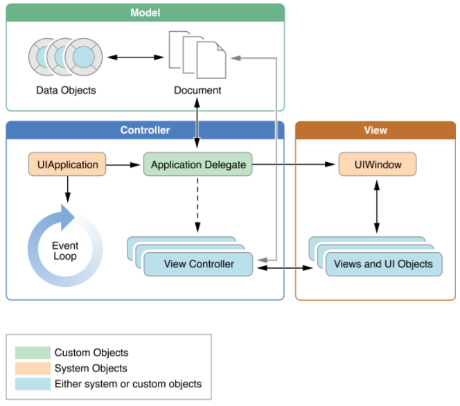
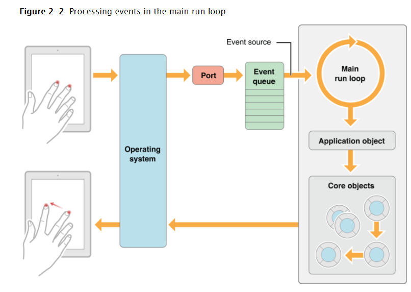
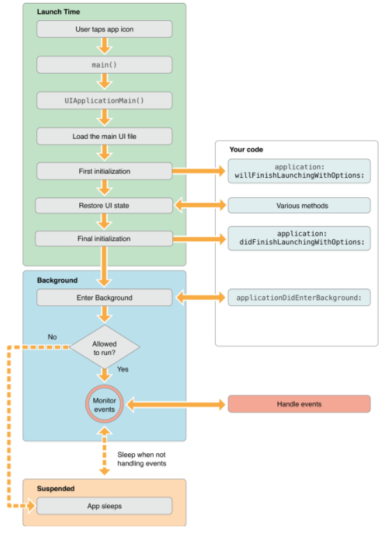

# App-Programming-Guide-for-iOS

App Programming Guide for iOS 문서 정리 작업


[IOS의 생명주기](https://soooprmx.com/archives/4454)


## 목차

* [chapter 1. Expected App Behaviors](#chapter1)
  * [1. Providing the Required Resources](#chapter1-1)
  * [2. The App Bundle](#chapter1-2)
  * [3. Supporting User Privacy](#chapter1-3)
  * [4. Internationalizing Your App](#chapter1-4)
* [chapter 2. The App Life Cycle](#chapter2)
  * [1. The Main Function](#chapter2-1)
  * [2. The Structure of an App](#chapter2-2)
  * [3. The Main Run Loop](#chapter2-3)
  * [4. Execution States for Apps](#chapter2-4)
  * [5. App Termination](#chapter2-5)
  * [6. Threads and Concurrency](#chapter2-6)
* [chapter 3. Background Execution](#chapter3)
  * [1. Executing Finite-Length Tasks](#chapter3-1)
  * [2. Downloading Content in the Background](#chapter3-2)
  * [3. Implementing Long-Running Tasks](#chapter3-3)
    * [Declaring Your App’s Supported Background Tasks](#chapter3-3-1)
    * [Tracking the User’s Location](#chapter3-3-2)
    * [Playing and Recording Background Audio](#chapter3-3-3)
    * [Implementing a VoIP App](#chapter3-3-4)
    * [Fetching Small Amounts of Content Opportunistically](#chapter3-3-5)
    * [Using Push Notifications to Initiate a Download](#chapter3-3-6)
    * [Downloading Newsstand Content in the Background](#chapter3-3-7)
    * [Communicating with an External Accessory](#chapter3-3-8)
    * [Communicating with a Bluetooth Accessory](#chapter3-3-9)
  * [4. Getting the User’s Attention While in the Background](#chapter3-4)
  * [5. Understanding When Your App Gets Launched into the Background](#chapter3-5)
  * [6. Being a Responsible Background App](#chapter3-6)
  * [7. Opting Out of Background Execution](#chapter3-7)
* [Chapter 4. Strategies for Handling App State Transitions](#chapter4)
  * [What to Do at Launch Time (not running -> inactive)](#chapter4-1)
  * [What to Do When Your App Is Interrupted Temporarily (active <-->inactive)](#chapter4-2)
  * [What to Do When Your App Enters the Foreground (backgaound->foregraound)](#chapter4-3)
  * [What to Do When Your App Enters the Background (foregraound ->backgraound)](#chapter4-4)
  * [Reduce Your Memory Footprint)](#chapter4-5)
* [chapter 5. Strategies for Implementing Specific App Features](#chapter5)


### About iOS App Architecture

IOS에서 동작하는 app은 사용자에게 훌륭한 사용자 경험을 제공하는 것을 보장 할 필요가 있다. 앱의 디자인과 UI가 좋은 것을 넘어서, 좋은 사용자 경험은 다른 많은 요소들을 포함하고 있다. 사용자는 IOS app을 사용하면서 가능하면 적은 전원을 사용하면서 빠르고 민감하게 반응해야 한다고 생각한다. (fast and responsive) 앱들은 최신 장치를 모두 지원하며 현재 장치도 적합하도록 할 필요가 있다. 이 모든 것들을 구현하는 것은 쉬운 일이 아니지만 IOS는 당신이 이것들을 해내도록 도와줄 것 이다.


<a name="chapter1"></a>

# chapter 1. Expected App Behaviors

이 쳅터에서는 모든 앱들에서 처리되어야 하는 동작과 개발 초기에 고려해야 할 동작을에 대해서 다룹니다.

<a name=chpater1-1></a>

### 1. Providing the Required Resources

제작하는 모든 앱은 iOS 기기에서 제대로 표시 될 수 있도록 다음과 같은 리소스 및 메타 데이터 집합이 있어야합니다.

* **An information property-list file**(프로퍼티 리스트의 정보) - Info.plist 파일에는 시스템이 앱과 상호 작용할 때 사용하는 앱에 대한 메타 데이터가 들어 있습니다. Xcode는이 파일을 프로젝트의 구성과 설정에 따라 자동으로 생성합니다. 이 파일의 내용을 직접 보거나 수정하려면 프로젝트의 정보 탭에서 할 수 있습니다. 이 파일을 편집하는 방법과 포함 할 키에 대한 권장 사항은 [여기](https://developer.apple.com/library/content/documentation/iPhone/Conceptual/iPhoneOSProgrammingGuide/ExpectedAppBehaviors/ExpectedAppBehaviors.html#//apple_ref/doc/uid/TP40007072-CH3-SW5)를 참조하세요. (안드로이드에서 Manifest.xml 파일과 같은 역할은 하는 것 같다.)
* **One or more icons** - 모든 앱은 기기의 홈 화면과 앱 스토어에 표시 할 아이콘을 제공해야합니다. 앱은 실제로 여러 상황에서 사용할 여러 아이콘을 지정할 수 있습니다. 예를 들어 앱은 검색 결과를 표시 할 때 사용할 작은 아이콘을 제공 할 수 있으며 고 해상도 디스플레이가있는 기기에 고해상도 아이콘을 제공 할 수 있습니다.
* **One or more launch images**(스플레시 화면) - 앱을 실행하면 앱에서 사용자 인터페이스를 표시 할 수있을 때까지 임시 이미지가 표시됩니다. 이 임시 이미지는 앱의 시작 이미지이며 앱이 시작되고 즉각적인 준비가 될 것이라는 즉각적인 피드백을 사용자에게 제공합니다. 앱에 하나 이상의 스플레시 이미지를 제공해야하며 특정 시나리오를 해결하기 위해 추가 스플레시 이미지를 제공해야합니다. ( 안드로이드 앱에서 역시 앱이 시작되고 초기 설정을 위해서 스플레시 엑티비티를 사용하곤 했었는데, 이를 IOS에서는 launch image라 하는 것 같다.)

이러한 리소스는 모든 앱에 필요하지만 전부는 아닙니다.Info.plist 파일에 기본적으로 포함하지 않는 많은 속성들이 있습니다. 대부분의 추가적인 속성들은 그 기능을 사용할 때만 포함합니다. 예를 들어 마이크를 사용하는 앱에는NSMicrophoneUsageDescription 키가 포함있어야 합니다.

<a name=chapter1-2></a>

### 2. The App Bundle

iOS 앱을 만들 때 Xcode는 번들로 묶습니다. 번들은 관련 자원들을 한곳으로 묶는 디렉토리입니다.  iOS 앱 번들에는 앱 실행 파일과 앱 아이콘, 이미지 파일 및 로컬 콘텐츠와 같은 지원 리소스 파일이 포함되어 있습니다.

아래 표는 MyApp이라는 앱이 있다고 가정할 때 Bundle에 속하는 file들입니다.

| File                                   | Example                                  | Description                              |
| -------------------------------------- | ---------------------------------------- | ---------------------------------------- |
| App executable                         | `MyApp`                                  | 실행 파일에는 앱의 컴파일 된 코드가 들어 있습니다. 앱의 실행 파일 이름은 앱 이름에서 .app 확장자를 뺀 것과 같습니다.이 파일은 필수 항목입니다. |
| The information property list file     | `Info.plist`                             | Info.plist 파일에는 앱의 구성 데이터가 들어 있습니다. 시스템은이 데이터를 사용하여 앱과 상호 작용하는 방법을 결정합니다.이 파일은 필수이며 Info.plist라고해야합니다. |
| App icons                              | `Icon.png``Icon@2x.png``Icon-Small.png``Icon-Small@2x.png` | 앱 아이콘은 기기의 홈 화면에서 앱을 나타내는 데 사용됩니다. 다른 아이콘은 적절한 위치에서 시스템에 의해 사용됩니다. 파일 이름에 @2x가 표시된 아이콘은 망막 디스플레이가있는 장치 용입니다. 응용 프로그램 아이콘이 필요합니다. |
| Launch images                          | `Default.png``Default-Portrait.png``Default-Landscape.png` | 앱이 실행되는 동안 시스템은이 파일을 임시 배경으로 사용합니다. 앱에서 사용자 인터페이스를 표시 할 준비가되면 즉시 사라집니다.  반드시 하나 이상의 launch image가 필요합니다. |
| Storyboard files (or nib files)        | `MainBoard.storyboard`                   | 기존에 xib 파일을 만들고 뷰와 뷰 컨트롤러를 연결하는 개발에서 스토리 보드기능이 생기면서 각각의 뷰를 쉽게 관리 할 수 있게 되었다. 스토리 보드에는 앱이 화면에 표시하는 뷰 및 뷰 컨트롤러가 포함되어 있습니다. 이 방법에서 뷰 간의 이동은 segue(세그웨이)를 통해서 이루어 진다. 스토리 보드의 사용은 필수는 아니지만 권장됩니다. |
| Ad hoc distribution icon               | `iTunesArtwork`                          | 만약에 개발 중 앱을 임시로 배포해야 하는 경우 512 x 512 픽셀의 앱 아이콘을 포함시켜야 합니다. 일반적인 경우 아이콘은 App store에 저장되는데, 임시로 배포되는 앱은 App Store를 거치지 않기 때문에 앱 번들에 아이콘이 있어야합니다. |
| Settings bundle                        | `Settings.bundle`                        | 사전에 설정을 지정해 맞춤 앱 환경을 제공하려면 이 파일이 번들에 포함되야 합니다. 이 번들에는 property list file의 데이터와 앱 환경 설정을 정의하는 다른 리소스 파일이 들어 있습니다. 앱은이 번들의 정보를 사용하여 앱에 필요한 인터페이스 요소를 조합합니다. |
| Nonlocalized resource files            | `sun.png``mydata.plist`                  | 로컬라이징을 고려하지 않은 리소스에는 앱에서 사용하는 이미지, 사운드 파일, 동영상 및 맞춤 데이터 파일과 같은 항목이 포함됩니다. 이 파일들은 모두 앱 번들의 최상위에 위치해야합니다. |
| Subdirectories for localized resources | `en.lproj``fr.lproj``es.lproj`           | 지역화 된 리소스는 언어 별 프로젝트 디렉토리에 배치해야하며 이름은 ISO 639-1 언어 약어와 .lproj 접미사로 구성됩니다. 예를 들어 en.lproj, fr.lproj 및 es.lproj 디렉토리에는 영어, 프랑스어 및 스페인어로 현지화 된 리소스가 포함되어 있습니다. iOS 앱은 국제화되어야하며 지원하는 각 언어에 대해 language.lproj 디렉토리가 있어야합니다. |

<a name=chapter1-3></a>

### 3. Supporting User Privacy

* 사용자 개인 정보 보호를위한 설계가 중요합니다. 대부분의 iOS 기기에는 사용자가 앱이나 외부에 공개하고 싶지 않은 개인 데이터가 포함되어 있습니다. 앱이 부적절하게 데이터에 액세스하거나 데이터를 사용하는 경우 사용자는 앱을 삭제 할 수 있습니다.
* 앱이 보호 된 항목을 사용하려고 시도하면 시스템에서 사용자에게 **액세스 권한을 묻는 경고 메시지**를 표시합니다. **iOS 10부터 Info.plist 파일에는 각 항목에 대한 권한 경고에 표시 할 목적 문자열이 포함되어야합니다.** 해당 용도 문자열을 제공하지 않고 앱이 보호 된 항목에 액세스하려고하면 앱이 종료됩니다.

<a name=chapter1-4></a>

### 4. Internationalizing Your App

 iOS 앱이 많은 국가에 배포되기 때문에 앱의 콘텐츠를 현지화하면 더 많은 고객에게 다가 갈 수 있습니다. 사용자는 모국어로 현지화되어있을 때 앱을 사용할 확률이 훨씬 높습니다. 사용자 지향 콘텐츠를 리소스 파일로 고려할 때 해당 콘텐츠를 현지화하는 것은 상대적으로 간단한 과정입니다.

 콘텐츠를 현지화하기 전에 현지화 작업을 용이하게하기 위해 앱을 **국제화(Internationalizing)**해야합니다. 응용 프로그램을 국제화하면 모든 사용자 지향 콘텐츠를 현지화 할 수있는 리소스 파일로 분해하고 해당 콘텐츠를 저장하기위한 언어 별 프로젝트 (.lproj) 디렉토리를 제공합니다.

* 스토리 보드 -스토리 보드에는 현지화해야하는 텍스트 레이블 및 기타 컨텐츠가 포함될 수 있습니다. 텍스트 길이의 변경 사항을 수용하도록 인터페이스 항목의 위치를 조정할 수도 있습니다. (마찬가지로, nib 파일에는 현지화가 필요한 텍스트 또는 업데이트해야하는 레이아웃이 포함될 수 있습니다.)
* 스트링 파일 - .strings 파일에는 이름을 지정한 정적 문자열들을 기록합니다. 이 때 다른 언어마다 이름이 같은 다른 언어로 문자열을 지정해 놓아야 합니다.
* 이미지 파일 - 이미지에 문화권 관련 콘텐츠가 포함되어 있지 않으면 이미지를 현지화하지 마십시오. 이미지 파일에 텍스트를 직접 저장하지 않아야합니다. 앱에서 로드하여 사용하는 이미지의 경우 문자열 파일에 텍스트를 저장하고 런타임에 해당 텍스트를 이미지와 합치도록 개발해야 합니다.
* 비디오 및 오디오 파일 - 언어 별 또는 문화권 별 콘텐츠가 포함되어 있지 않으면 멀티미디어 파일의 현지화는 피해야합니다. 예를 들어, 음성 해설 트랙이 포함 된 비디오 파일을 현지화하고자 할 수 있습니다.


<a name=chapter2></a>


# chapter 2. The App Life Cycle

**앱은 사용자 정의 코드와 시스템 프레임 워크 간의 정교한 상호 작용입니다.** 시스템 프레임 워크는 모든 앱이 실행해야하는 기본 인프라를 제공하며 해당 인프라를 개발자가 커스텀 하는데 필요한 코드들을 지원합니다. 이를 효과적으로 수행하려면 iOS 인프라와 작동 방식에 대해 약간 이해해야합니다.

<a name=chapter2-1></a>

### 1. The Main Function

모든 C 기반 앱의 진입 점이 main 함수이며 iOS 앱도 마찬가지입니다. 다른점은 IOS App은 Main 함수를 직접 작성하지 않고 Xcode가 자동으로 생성해 준다는 것 입니다. 몇 가지 예외를 제외하고는 Xcode가 제공하는 주요 기능의 구현을 절대 변경해서는 안됩니다.

```
#import <UIKit/UIKit.h>
#import "AppDelegate.h"
 
int main(int argc, char * argv[])
{
    @autoreleasepool {
        return UIApplicationMain(argc, argv, nil, NSStringFromClass([AppDelegate class]));
    }
}
```

Main 함수에 대해 언급할 한가지는 UIApplicationMain에 컨트롤을 넘긴다는 점 입니다. UIApplicationMain 함수에서는 스토리보드 파일과 사용자가 입력한 최초 초기화 코드들을 수행해 앱의 핵심 기능들을 작동시킵니다. 따라서 초기화를 위해 사용자는 스토리 보드 파일과 사용자 지정 초기화 코드를 넘겨줘야 합니다.

<a name=chapter2-2></a>

### 2. The Structure of an App

 앱을 시작하는 동안 UIApplicationMain 함수는 여러 핵심 개체를 설정하고 실행중인 응용 프로그램을 시작합니다. 모든 iOS 응용 프로그램의 핵심은 UIApplication 객체입니다.이 객체는 시스템과 응용 프로그램의 다른 객체 간의 상호 작용을 용이하게합니다.




모든 iOS 응용 프로그램의 핵심은 UIApplication 객체입니다.이 객체는 시스템과 응용 프로그램의 다른 객체 간의 상호 작용을 용이하게합니다.

* iOS앱은 사실 `UIApplication`이라는 클래스의 객체이다. 프로젝트의 `main` 함수는 기본적으로 `UIApplication` 클래스의 인스턴스를 만들어서 GUI를 사용하기 위한 런루프를 돌려주는 작업을 수행한다. 그리고 그 이후에 앱 내에서 일어나는 모든 처리는 `UIApplication` 객체가 관리하게 된다.
  * 1. 아이폰에서 사용자가 어플리케이션을 Tap 해서 실행
       undefined해당 어플리케이션의 main 실행
        undefinedmain 에서 UIApplicationMain() 실행 
        undefinedAppDelegate 의 applicationDidFinishLaunching: 을 호출
        undefinedapplicationDidFinishLaunching이 완료되면  EventLoop로 들어감
        undefined이제부터는 개발자가 코드로 구현한 작업들 수행
        undefined어플리케이션 종료
        undefinedAppDelegate의 applicationWillTerminate: 호출
        undefined어플리케이션 종료

[The role of objects in an iOS app]

| Object                                   | Description                              |
| ---------------------------------------- | ---------------------------------------- |
| `UIApplication`object                    | UIApplication는 이벤트 루프를 포함한 기타 상위 응용 프로그램 동작을 관리합니다. 또한 주요 앱 전환과 일부 특수 이벤트 (예 : 수신 푸시 알림)를 정의한 맞춤 델리게이트로 위임합니다. |
| App delegate object                      | 앱 델리게이트는 커스텀 코드의 핵심입니다. 이 객체는 UIApplication 객체와 함께 작동하여 응용 프로그램 초기화, 상태 전환 및 많은 고급 응용 프로그램 이벤트를 처리합니다. 이 객체는 모든 응용 프로그램에 존재할 수있는 유일한 객체이기 때문에 응용 프로그램의 초기 데이터 구조를 설정하는 데 자주 사용됩니다.  앱 델리게이트는 이름 그대로 앱 객체의 대리인 역할을 한다. UIApplication은 서브 클래싱을 하는 경우도 드물고, 별로 그럴 이유도 없으며 그게 쉽지도 않다. 하지만 분명히 앱의 라이프 사이클의 여러 스테이지에서 수행되어야 하는 일은 있다. 따라서 앱 객체 클래스를 직접 서브 클래싱하지 않고 델리게이트를 통해 처리하게 된다. |
| Documents and data model objects         | 데이터 모델 객체는 앱의 콘텐츠를 저장하며 앱에만 적용됩니다. 애플리케이션은 Documents (UIDocument의 사용자 정의 하위 클래스)를 사용하여 데이터 모델 객체 일부 또는 전체를 관리 할 수도 있습니다. 문서 객체는 필수는 아니지만 단일 파일 또는 파일 패키지에 속한 데이터를 그룹화하는 편리한 방법을 제공합니다. |
| View controller objects                  | View controller는 보여주는 앱의 화면을 관리합니다. UIViewController 클래스는 모든 뷰 컨트롤러 객체의 기본 클래스입니다. 로딩, 화면 회전 등 표준 시스템 동작을위한 기본 기능을 제공합니다. UIKit 및 기타 프레임 워크는 이미지 선택기, 탭 표시 줄 인터페이스 및 탐색 인터페이스와 같은 표준 시스템 인터페이스를 구현하기 위해 추가적인 컨트롤러 클래스를 정의합니다. |
| `UIWindow`object                         | UIWindow 객체는 화면에서 하나 이상의 뷰를 관리합니다. 대부분의 앱에는 내용을 보여주는 Window가 하나만 있지만 외부 화면에 표시될 내용을 보여주는 추가적인 Window가 있는 앱도 있습니다. 앱의 콘텐츠를 변경하려면 뷰 컨트롤러를 사용하여 표시된 뷰를 변경해야 합니다. 절대 Window자체를 바꿀 수 없습니다. Window는 뷰를 표시하는 것 외에도 UIApplication과 함께 뷰의 이벤트 전달합니다. |
| View objects, control objects and layer objects | 뷰 및 컨트롤은 앱 콘텐츠의 시각적 표현을 제공합니다. 뷰는 지정된 직사각형 영역에 내용을 그리고 그 영역 내의 이벤트에 응답하는 객체입니다. 컨트롤은 버튼, 텍스트 필드 및 토글 스위치와 같은 친숙한 인터페이스 개체를 구현하는 특수 유형의 뷰입니다. UIKit 프레임 워크는 다양한 유형의 콘텐츠를 표시하기위한 standard views를 제공합니다. 또한 UIView를 직접 서브 클래 싱하여 자신 만의 커스텀 View를 정의 할 수 있습니다. 또한 뷰 및 컨트롤을 통합하는 것 외에도 Core Animation 레이어를 뷰 및 컨트롤 계층에 통합 할 수 있습니다. 레이어 객체는 실제로 시각적 인 내용을 나타내는 데이터 객체입니다. 뷰는 레이어 객체를 집중적으로 사용하여 내용을 렌더링합니다. 인터페이스에 사용자 정의 레이어 객체를 추가하여 복잡한 애니메이션 및 기타 유형의 정교한 시각 효과를 구현할 수도 있습니다. |

<a name=chapter2-3></a>

### 3. The Main Run Loop

 앱의 기본 실행 루프는 모든 사용자 관련 이벤트를 처리합니다. UIApplication 객체는 실행시 기본 실행 루프를 설정하고 이를 사용하여 이벤트를 처리하고 뷰 기반 인터페이스에 대한 업데이트를 처리합니다. 이름에서 알 수 있듯이 기본 실행 루프는 앱의 main 스레드에서 실행됩니다. 이 동작은 사용자 관련 이벤트가 수신 된 순서대로 순차적으로 처리되도록합니다.



*  사용자가 기기와 상호 작용할 때 시스템에서 이러한 상호 작용과 관련된 이벤트를 생성 하고 UIKit에 의해 설정된 특수 포트를 통해 앱에 전달됩니다.
*  이벤트는 앱에 의해 내부적으로 대기열에 넣어지고 실행을 위해 Main Run Loop에 하나씩 전달됩니다. 
*  UIApplication 객체는 이벤트를 수신하여 수행해야 할 작업을 결정하는 첫 번째 객체입니다.
*  터치 이벤트는 대개 메인 윈도우 객체에 전달되고, 터치는 터치가 발생한 뷰에 전달합니다. 다른 이벤트는 다양한 앱 객체를 통해 약간 다른 경로를 취할 수 있습니다.

이러한 이벤트 유형의 대부분은 앱의 Main Run Loop를 사용하여 전달되지만 일부 이벤트 유형은 제공되지 않습니다. 일부 이벤트는 델리게이트 객체로 전송되거나 사용자가 제공 한 블록으로 전달됩니다.

| 이벤트 타입                                   | 전달            | 비고                                       |
| ---------------------------------------- | ------------- | ---------------------------------------- |
| Touch                                    | 이벤트가 발생한 뷰 객체 | 뷰는 응답 객체입니다. 뷰에 의해 처리되지 않은 모든 터치 이벤트는 처리를 위해 응답 체인에 전달됩니다. |
| Remote control,<br />Shake motion events | 첫 번째 응답자 객체   | 원격 제어 이벤트는 미디어 재생을 제어하기위한 것으로, 헤드폰 및 기타 액세서리로 생성됩니다. |
| Accelerometer<br />Magnetometer<br />Gyroscope | 사용자 지정 객체     | 가속도계, 자력계 및 자이로 스코프 하드웨어와 관련된 이벤트는 사용자가 지정하는 객체로 전달됩니다. |
| Location                                 | 사용자 지정 객체     | 핵심 위치 프레임 워크를 사용하여 위치 이벤트를 수신하도록 등록하십시오. |
| Redraw<br />(화면 갱싱)                      | 갱신이 필요한 객체    | 다시 그리기 이벤트는 이벤트 객체를 포함하지 않지만 단순히 그 자체를 그리기 위해 뷰를 호출하는 것입니다. |

<a name=chapter2-4></a>

### 4. Execution States for Apps

 언제든지 앱은 표에 나열된 상태 중 하나에 있습니다. 시스템은 시스템 전체에서 일어나는 작업에 응답하여 앱을 상태에서 상태로 이동시킵니다.

| State       | Description                              |
| ----------- | ---------------------------------------- |
| Not running | 앱이 시작되지 않았거나 실행 중이었지만 시스템에서 종료되었습니다.     |
| Inactive    | 앱이 포어그라운드에서 실행 중이지만 현재 이벤트를 수신하지 않습니다. (그것은 다른 코드를 실행하고 있을지도 모른다.) 앱은 대개 다른 상태로 이동 할 때 잠깐 동안이 상태에 머문다. |
| Active      | 앱이 포어그라운드에서 실행 중이며 이벤트를 수신하고 있습니다. 이것은 포어그라운드 앱을위한 정상 모드입니다. |
| Background  | 앱이 백그라운드에서 코드를 실행하고 있습니다. 대부분의 앱은 Suspended 상태 이전에 잠시 이 상태가됩니다. 그러나 추가 실행 시간을 요청하는 앱은 잠시동안만 이 상태로 유지 될 수 있습니다. 또한 백그라운드로 직접 실행되는 앱은 비활성 상태 대신이 상태로 전환됩니다. 백그라운드에서 코드를 실행하는 방법에 대한 자세한 내용은 백그라운드 실행을 참조하십시오. |
| Suspended   | 앱이 백그라운드에 있지만 코드를 실행하지 않습니다. 시스템은 앱을 자동으로이 상태로 이동시키고 그렇게하기 전에 앱에 알리지 않습니다. Suspended상태에서 앱은 메모리에 남아 있지만 코드는 실행하지 않습니다. 메모리 부족 상태가 발생하면 시스템이 Suspended된 앱을 예고없이 삭제하여 포 그라운드 앱에 더 많은 공간을 확보 할 수 있습니다. |

* inactive와 active 상태를 합쳐 Foreground라고 합니다.

예를 들어 사용자가 홈 버튼을 누르면 전화가 걸리거나 다른 여러 가지 중단이 발생하면 현재 실행중인 앱이 응답으로 상태가 변경됩니다. 그림은 상태에서 상태로 이동할 때 앱이 수행하는 경로를 보여줍니다.


- Application의 생명주기 사이 사이 호출되는 메소드들로 이 메소드들을 이용해 어플리케이션의 생명주기에 따른 앱의 관리를 할 수 있다. 

- 안드로이드의 엑티비티의 역할을 하는 것은 View Controller이며 View Controller 역시 별도의 생명주기를 가지고 있습니다. 안드로이드에서 onResume, onPause에서 하던 현재 상태 저장은 View Controller의 생명 주기 안에서 진행하면 됩니다.

  ```
  1. (BOOL)application:(UIApplication *)application didFinishLaunchingWithOptions:(NSDictionary *)launchOptions
      => 어플리케이션이 처음 실행될 때. (처음 메모리상에 올라가게 될 때를 말함)
      => 앱의 화면이 사용자에게 보여지기 직전에 최종 초기화 작업을 진행할 수 있습니다.
      
  2. (void)applicationDidBecomeActive:(UIApplication *)application
      => 어플리케이션이 활성화 될 때, 
      => 즉 didFinishLaunchingWithOption 호출 직후, 어플리케이션이 백그라운드로 돌아갔다가 다시 불러질 때 호출
      => 안드로이드의 onResume처럼 일시적으로 저장했던 앱의 상태를 복원할 때 필요한 코드를 기입해두면 될것 같다.
       
  3. (void)applicationWillResignActive:(UIApplication *)application
      => 어플리케이션이 백그라운드로 들어가기 직전(홈버튼을 누른 직후)에 호출
      => 안드로이드의 onPause처럼 백 그라운드로 들어갔다가 언제 종료될지 모르는 앱의 현재 상태를 저장하기 위해서 준비하는 코드를 기입하는게 좋아 보인다.
      
  4. (void)applicationDidEnterBackground:(UIApplication *)application
      => 어플리케이션이 백그라운드로 완전히 들어갔을 때 호출됨
      => 앱의 백그라운드에 실행중이며 언제든지 suspended 상태가 될 수 있음을 알립니다.
      
  5. (void)applicationWillEnterForeground:(UIApplication *)application
      => 어플리케이션이 다시 활성되 되기 직전에 호출됨
      =>앱이 백그라운드에서 벗어나 포 그라운드로 돌아 왔지만 아직 활성화되지 않았 음을 알 수 있습니다. 
      =>백그라운드 상에서 다시 어플리케이션이 활성되 되면 willEnterForeground 호출 후 applicationDidBecomeActive 호출
         
  6. (void)applicationWillTerminate:(UIApplication *)application 
      => 어플리케이션이 완전히 종료되기 직전에 호출 됨
  ```


<a name=chapter2-5></a>

### 5. App Termination

 앱은 언제든지 종료될 수 있도록 준비되어야하며 사용자 데이터를 저장하거나 다른 중요한 작업을 수행 할 때까지 기다려서는 안됩니다. 시스템에 의한 종료는 앱 수명주기의 정상적인 부분입니다. 시스템에 의한 종료는 일반적으로 메모리가 부족할 때  suspended의 앱을 종료시키지만,  오작동하거나 응답이 없는 앱을 종료 할 수도 있습니다.

* suspended 상태의 앱은 시스템이 메모리를 회수하기 위해서 종료시킬 때 알림을 받지 못합니다.
* 앱이 현재 백그라운드에서 실행 중지만 suspended 상태가 아닌 경우 시스템은 종료하기 전에applicationWillTerminate :를 호출합니다. 
* 하지만 장치가 재부팅될 때에는 이 메소드를 호출하지 않습니다.

 사용자는 multitasking UI를 이용해서 앱을 종료 시킬 수 도 있습니다. 이 경우 suspended 상태와 마찬가지로 사용자는 알림을 받지 못합니다.

<a name=chapter2-6></a>

### 6. Threads and Concurrency

 IOS는 앱의 메인 스레드에서 동작하고 필요에 따라 추가적인 스레드를 생성 할 수 있습니다. IOS는 이러한 스레드들을 직접 관리하기 보다는 GCD(Grand Central Dispatch)를 이용해서 관리합니다.

* GCD(Grand Central Dispatch)란, C언어로 되어 있는 스레드 관리 기술로 iOS4 부터 지원하고 있다.
* 또한, GCD와 같은 시점에 등장한 블럭 코딩 기반으로 기존에 사용하던 NSThread, NSOperation 보다 쉽게 스레드 응용 기술을 구현할 수 있도록 지원해준다.

 GCD와 같은 기술을 사용하여 수행 할 작업과 수행 할 작업을 정의 할 수 있지만, 사용 가능한 CPU에서 해당 작업을 가장 효과적으로 실행하는 방법을 시스템이 결정하도록 할 수 있습니다. 시스템이 스레드 관리를 처리하도록하면 작성해야하는 코드가 단순 해지고 코드의 정확성을 보장하기가 쉬워지고 전반적인 성능이 향상됩니다.

 스레드와 동시성에 대해 생각할 때 다음을 고려하십시오.

* 뷰, Core Animation 및 다른 많은 UIKit 클래스와 관련된 작업은 일반적으로 메인 스레드에서 발생해야합니다. 이 규칙에는 몇 가지 예외가 있습니다. 예를 들어 이미지 기반 조작은 종종 백그라운드 스레드에서 발생할 수 있지만 의심 스러울 때는 작업이 주 스레드에서 발생해야한다고 가정합니다.
* 긴 작업은 항상 백그라운드 스레드에서 수행해야합니다. 네트워크 액세스, 파일 액세스 또는 대용량 데이터 처리와 관련된 작업은 모두 GCD 또는 작업 객체를 사용하여 비동기 적으로 수행해야합니다.
* 메인 스레드에서 앱 시작시 작업을 최소화 하십시오. 실행시 앱은 가능한 한 빨리 사용자 인터페이스를 설정할 수있는 시간을 사용해야합니다. 앱시 실행되고 최대한 빨리 사용자가 사용 할 수 있는 Active 상태로 만들기 위해서입니다. 주 스레드에서 사용자 인터페이스 설정에 기여하는 작업만 수행해야합니다. 다른 모든 작업은 비동기 적으로 실행해야하며 결과가 준비되는 즉시 사용자에게 표시됩니다.

<a name=chapter3></a>

## chapter 3. Background Execution

 사용자가 앱을 적극적으로 사용하지 않을 경우 시스템은 앱을 백그라운드 상태로 이동시킵니다. suspended 상태는 배터리 수명을 향상시키는 방법이기도하므로 시스템이 새로운 포 그라운드 앱에 중요한 시스템 리소스를 할당 할 수 있습니다.

 대부분의 앱은 suspended 상태로 쉽게 이전 할 수 있지만 앱이 백그라운드에서도 동작하는 중요한 이유가 있습니다. 예를들어 하이킹 앱은 시간 경과에 따라 사용자의 위치를 추적하여 해당 코스가 하이킹 지도 위에 겹쳐서 표시되도록 할 수 있습니다. 오디오 앱은 잠금 화면에서 계속 음악을 재생해야 할 수 있습니다. 다른 앱은 백그라운드에서 콘텐츠를 다운로드하여 콘텐츠를 사용자에게 제공 할 때 지연을 최소화 할 수 있습니다. 앱을 백그라운드에서 실행하는 것이 필요하다고 판단되면 iOS는 시스템 리소스 또는 사용자 배터리를 소모하지 않고 효율적으로 수행 할 수 있도록 도와줍니다.

 iOS에서 제공하는 기술은 세 가지 범주로 나뉩니다.

* 포어 그라운드에서 짧은 작업만 수행하는 앱은 앱이 백 그라운드로 이동할 때 작업을 끝내기 위해서 시간을 더 요청 할 수 있습니다.
* 포어 그라운드에서 다운로드를 시작하는 앱은 시스템도 다운로드를 할 수 있기 때문에 다운로드가 지속되는 사이에 앱을 종료시키거나 suspended 상태로 만들 수 있습니다.
* 백그라운드에서 특정 작업을 진행해야 하는 앱은 시스템에 백그라운드 상태로 요청 할 수 있습니다.

 사용자 경험을 향상시키는 경우가 아니라면 백그라운드 작업은 되도록 피해야 합니다. 사용자가 다른 앱을 실행 했거나 기기를 잠글 경우 앱이 백그라운드 상태로 넘어갈 수 있습니다. 두 경우 모두 사용자가 앱이 의미있는 작업을 수행 할 필요가 없다는 신호입니다. 이러한 경우 베터리를 계속 소모하고 사용자가 앱을 삭제 할 수동 있습니다. 따라서 백그라운드에서하는 일에 유의하고 가능하면 피하십시오.

<a name=chapter3-1></a>

### 1. Executing Finite-Length Tasks

 백그라운드 상태로 이동한 앱은 시스템에 의해 suspended 상태가 될 수 있도록 가능한 한 빨리 조용한 정지 상태(quiescent state)로 만들어야 합니다.

 만약 앱이 아직 작업 중이거나 작업을 완료하기 위해서 추가 시간이 필요할 경우 UIApplication의`beginBackgroundTaskWithName:expirationHandler:` 혹은 `beginBackgroundTaskWithExpirationHandler:` 메소드를 호출 하여 작업을 완료할 추가 시간을 벌 수 있습니다. 작업이 완료된 후에는  `endBackgroundTask`  메소드를 호출하여 시스템이 작업을 마쳤으며 suspended 상태가 될 수 있음을 알려야합니다.

* `beginBackgroundTaskWithName:expirationHandler:` 혹은 `beginBackgroundTaskWithExpirationHandler:` 를 호출하면 고유한 토큰 값이 생성되고 작업 완료 후 이 토큰과 함께  `endBackgroundTask`  를 호출해야 합니다.
* 만약,  `endBackgroundTask` 를 호출하지 않는다면 시스템이 앱을 정지시켜 버립니다. 그렇기 때문에 추가 작업을 시작 할 때 만기 핸들러 ( expriationHandeler )를 설정해두면 시스템이 이 핸들러를 호출하면서 앱이 강제 종료 될 위험을 피할 수 있습니다.

 백그라운드 작업을 진행하기 위해서 앱이 백그라운드로 이동할 때 까지 기다릴 필요 없이 `beginBackgroundTaskWithName:expirationHandler:` 혹은 `beginBackgroundTaskWithExpirationHandler:`를 호출하고 하고 작업을 완료하자 마자  `endBackgroundTask` 를 호출하면 앱이 포어 그라운드 상태에서도 백 그라운드 작업을 완료 할 수 있습니다.

```
<Starting a background task at quit time>

- (void)applicationDidEnterBackground:(UIApplication *)application
{
    bgTask = [application beginBackgroundTaskWithName:@"MyTask" expirationHandler:^{
        // Clean up any unfinished task business by marking where you
        // stopped or ending the task outright.
        [application endBackgroundTask:bgTask];
        bgTask = UIBackgroundTaskInvalid;
    }];
 
    // Start the long-running task and return immediately.
    dispatch_async(dispatch_get_global_queue(DISPATCH_QUEUE_PRIORITY_DEFAULT, 0), ^{
 
        // Do the work associated with the task, preferably in chunks.
 
        [application endBackgroundTask:bgTask];
        bgTask = UIBackgroundTaskInvalid;
    });
}
```

 자기만의 만기 핸들러를 만들어 필요한 작업이 종료되는데 필요한 작업들을 추가 할 수 있습니다. 하지만 만기 핸들러가 동작한다는 것은 이미 앱의 제한 시간이 거의 끝다는 뜻이기 때문에, 만기 코드에서는 너무 오랜 시간이 걸리지 않아야 합니다. 따라서 만기 핸들러에서는 최소한의 작업만을 진행해야 합니다.

<a name=chapter3-2></a>

### 2. Downloading Content in the Background

 파일을 다운로드 할 때 앱은 NSURLSession 오브젝트를 사용하여 다운로드를 시작해야 앱이 suspended 상태로 넘어가거나 심지어 종료된다 할지라도 다운로드를 진행 할 수 있습니다. 백그라운드 다운로드를 위해서 NSURLSession 객체를 구성해서 시스템에 전달하면 시스템이 별도의 프로세스로 관리하고 상태를 다시 앱에 보고합니다. 시스템에 의해서 다운로드를 진행하고 있던 중 앱이 종료되도 시스템은 다운로드를 계속 진행합니다. 다운로드가 완료된 후 필요하다면 앱을 다시 실행시킬 수 있습니다.

 백그라운드 전송을 지원하려면 NSURLSession 객체를 적절하게 구성해야합니다. NSURLSession을 구성하려면 먼저 NSURLSessionConfiguration 객체를 만들고 여러 속성을 적절한 값으로 설정해야합니다. 그런 다음 세션을 만들 때 해당 구성 객체를 NSURLSession의 적절한 초기화 메서드에 전달합니다.


 백그라운드 다운로드를 위해 만들어야 하는 Configuration 설정은 다음과 같습니다.

1. `NSURLSessionConfiguration`의 `backgroundSessionConfigurationWithIdentifier :` 메소드를 사용하여 구성 객체를 만듭니다.
2. 구성 개체의 `sessionSendsLaunchEvents` 속성 값을 `YES`로 설정합니다.
3. 만약에 포어 그라운드 상태에서 전송을 시작한다면, configuration 객체의 `discretionary`  속성도 역시 `YES`로 만드는 것을 권장합니다.
4. configuration 객체의 다른 특성도을 적절하게 구성하십시오.
5. 이 Configuration 객체를 이용해서 `NSURLSession` 객체를 생성하십시오.

 일단 구성되면, `NSURLSession` 객체는 업로드나 다운로드 작업을 시스템에 전달합니다. 앱이 실행 중에 작업이 완료되면(포어그라운드 상태이든 백그라운드 상태이든 상관 없이), 세션 객체는 델리게이트에 작업 종료를 알립니다.  만약 작업이 끝나지 않은 상태에서 시스템이 앱을 종료시켜 버린다면 다운로드 작업은 시스템에 의해서 관리됩니다. 하지만 사용자가 원해서 앱을 종료시키게 된다면 시스템은 전송 작업을 중지합니다.


 sessionSendsLaunchEvents 속성이 YES로 설정되었고 사용자가 앱을 강제 종료하지 않았다고 가정합시다.

 백그라운드 세션과 관련된 모든 작업이 완료되면 시스템은 종료 된 응용 프로그램을 다시 실행하고 응용 프로그램 대리인의 `application : handleEventsForBackgroundURLSession : completionHandler : `메서드를 호출합니다.

(시스템은 인증 문제 또는 앱의 주의가 필요한 이벤트를 처리하기 위해 앱을 다시 실행할 수도 있습니다.)

 이 경우 기존에 요청했던 동일한 설정으로 `NSURLSessionConfiguration` 및 `NSURLSession` 객체를 만듭니다. 시스템은 새 세션 개체를 이전 작업에 다시 연결하고 해당 상태를 세션 개체의 델리게이트에게보고합니다.

<a name=chapter3-3></a>

### 3. Implementing Long-Running Tasks

 수행하는데 긴 시간이 걸리는 작업들 백그라운드에서 수행하기 위해서 구현할 때에는 앱이 백그라운드에서 Suspended 상태로 넘어가지 않게 하기 위해서 특정 권한을 요청해야 합니다.

* 음악 플레이어 앱과 같이 백그라운드에서 사용자에게 오디오 콘텐츠를 재생하는 앱
* 백그라운드에서 오디오 콘텐츠를 기록하는 앱 (녹음 앱 같이)
* 사용자가 내비게이션 앱과 같이 항상 내 위치를 계속 알려주는 앱
* VoIP (Voice over Internet Protocol)를 지원하는 응용 프로그램
* 새 콘텐츠를 정기적으로 다운로드하고 처리해야하는 앱
* 외부 액세서리를 정기적으로 업데이트하는 앱

 이러한 백그라운드 서비스를 구현하는 앱은 지원하는 서비스를 선언하고 해당 서비스와 관련된 내용을 사용하기 위해서 시스템 프레임워크를 사용해야 합니다.


TODO: 무슨 말인지 잘 이해가 안된다.

(Apps that implement these services must declare the services they support and use system frameworks to implement the relevant aspects of those services. Declaring the services lets the system know which services you use, but in some cases it is the system frameworks that actually prevent your application from being suspended.) 

<a name=chapter3-3-1></a>

* #### Declaring Your App’s Supported Background Tasks

  * 일부 백그라운드 작업들은 그것들을 수행하기 위해서 반드시 추가적인 선언이 필요하다. Xcode5 버전 이후로는 이런 백그라운드 모드들을 프로젝트 셋팅의 `Capabilities `탭에서 선언이 가능하다. 이런 백그라운드 모드들을 추가하기 위해서는 앱의  `Info.plist`파일에  `UIBackgroundModes` key를 추가해줘야 한다.
  * 아래 표는 Xcode의 `UIBackgroundModes` key에서선택할 수 있는 백그라운운드 모드들이다.

  | Xcode background mode            | UIBackgroundModes value | Description                              |
  | -------------------------------- | ----------------------- | ---------------------------------------- |
  | Audio and AirPlay                | `audio`                 | 앱은 오디오 콘텐츠나 녹음을 백그라운드에 재생할 수 있다. (이런 콘텐츠들은 오디오 스트리밍이나 AirPlay를 이용한 비디오 재생도 포함한다.) 사용자는 처음 사용하기 전에 앱에서 마이크 사용 권한을 허가해야 한다. |
  | Location updates                 | `location`              | 앱은 백그라운드 상태에서도 지속적으로 위치 정보를 갱신해야 한다.     |
  | Voice over IP                    | `voip`                  | 앱은 인터넷을 이용한 통화 기능을 사용자에게 제공해야한다.         |
  | Newsstand downloads              | `newsstand-content`     | 뉴스앱은 백그라운드에서도 잡지나 신문의 내용을 다운로드 할 수 있는 옵션입니다. |
  | External accessory communication | `external-accessory`    | 외부의 하드웨어 악세사리들의 업데이트를 진행하기 위해서 이 옵션이 필요합니다. |
  | Uses Bluetooth LE accessories    | `bluetooth-central`     | 이 옵션은 Core Core Bluetooth framework를 통해서 정기적인 블루투스 악세사리의 정기적인 업데이트를 지원해야 합니다. |
  | Acts as a Bluetooth LE accessory | `bluetooth-peripheral`  | 이 옵션은 블루투스 통신을 하기 위해서 이 옵션이 필요합니다.       |
  | Background fetch                 | `fetch`                 | 정기적으로 네트워크에서 소량의 데이터를 다운받기 위해서 이 옵션이 필요합니다. |
  | Remote notifications             | `remote-notification`   | 푸시 알림이 도착하면 앱에서 콘텐츠 다운로드르 시작하려고 합니다. 이 옵션은 푸시 알림과 관련된 콘텐츠를 표시하는데 걸리는 시간을 최소화 합니다. |

   위의 각 모드는 관련 이벤트에 응답하기 위해 백그라운드에서 앱이 깨어나거나 시작되어야한다는 것을 시스템에 알립니다. 예를 들어 음악 재생을 시작한 다음 바탕화면으로 이동한 앱은 오디오 출력 버퍼를 채우기 위한 실행 시간이 필요합니다. 오디오 버퍼를 채우기 위해서 적절한 간격으로 시스템 프레임 워크에 콜백 메세지를 계속 날려 작업을 합니다. 이 모드를 선택하지 않으면 앱이 배경으로 이동할 때 앱에서 재생 또는 녹음되는 오디오가 중지됩니다.

  <a name=chapter3-3-2></a>

* ### Tracking the User’s Location

   백그라운드에서 사용자의 위치를 추적하는 데는 여러 가지 방법이 있습니다. 대부분의 경우 앱이 백그라운드에서 계속 실행될 필요가 없습니다.

  - 극적인 변경 위치 서비스? (The significant-change location service) - (권장됨)
  - 오직 포어 그라운드에서만 진행하는 위치 서비스
  - 백그라운드에서 실행되는 위치 서비스

  **The significant-change location service**

  >  극적인 변경 위치 서비스는 정확한 위치 데이터가 필요 없는 앱에서 추천됩니다. 이 서비스는 오직 사용자의 위치가 극적으로 변경될 때만 업데이트 됩니다.그러므로 이것은 소셜앱이나 위치와 연관되서 큰 위험이 없는 앱에서 사용됩니다. 만약 위치가 업데이트 될 때 앱이 suppended 상태라면, 시스템은 백그라운드에서 이 앱을 깨웁니다. 앱이 종료된 상태에서 새 위치를 사용할 수있게되면 시스템이 자동으로 응용 프로그램을 다시 실행합니다. 이 서비스는 iOS 4 이상에서 사용할 수 있으며 휴대 전화가있는 기기에서만 사용할 수 있습니다.

  **표준 위치 기반 서비스**

    포 그라운드 전용 및 백그라운드 위치 서비스는 모두 표준 위치 핵심 위치 서비스를 사용하여 위치 데이터를 검색합니다. 유일한 차이점은 포 그라운드 전용 위치 서비스는 앱이 일시 중지 된 경우 업데이트를 제공하지 않기 때문입니다. 앱이 다른 백그라운드 서비스 나 작업을 지원하지 않을 경우 발생할 수 있습니다. 포 그라운드 전용 위치 서비스는 포 그라운드에서 위치 데이터 만 필요로하는 앱을 대상으로합니다.
표준 위치기반 서비스는 위치 기반 하드웨어를 계속 사용하기 때문에 배터리를 많이 소비합니다. 앱이 계속 정확한 위치를 정보를 제공할 필요가 없다면 The significant-change location service를 사용하는 것이 좋습니다.

<a name=chapter3-3-3></a>

* ### Playing and Recording Background Audio

  백그라운에서도 오디오를 계속 재생하거나 녹음하는 앱은 해당 작업을 계속 수행하기 위해서는 UIBackgroundModes 키를 포함시켜이 지원을 활성화 할 수도 있습니다.

  * 배경 오디오 앱의 일반적인 예는 다음과 같습니다.
    * 뮤직 플레이어 앱
    * 오디오 녹음 앱
    * AirPlay를 통해 오디오 또는 비디오 재생을 지원하는 애플리케이션
    * VoIP 앱

   UIBackgroundModes 키에 오디오 값이 포함되어 있으면 시스템의 **미디어 프레임워크**가 자동으로 해당 앱이 백그라운드로 이동할 때 일시 중지되지 않도록합니다. 오디오 또는 비디오 콘텐츠를 재생하거나 오디오 콘텐츠를 녹음하는 동안 앱은 백그라운드에서 계속 실행됩니다. 그러나 녹화 또는 재생이 중지되면 시스템에서 앱을 일시 중지합니다.

   미디어 프레임워크에 동시에 여러 오디오 재생을 요청하게 되면 우선순위를 매겨 처리하는데, 포어 그라운드의 앱이 가장 높은 우선 순위를 가집니다.

  <a name=chapter3-3-4></a>

* ### Implementing a VoIP App

   VoIP 앱을 통해서 사용자는 디바이스의 전화 서비스 대신에 인터넷 서비스를 이용해서 전화를 걸 수 있습니다. 이러한 앱은 지속적으로 네트워크를 연결해야 하는데, 앱을 항상 실행시키고 있는 것 보다 소켓을 모니터링 하는 기능을 제공합니다. 시스템은 소켓에 트래픽이 들어오는 것을 감지하면 앱을 깨우고 제어권을 넘깁니다.

  VoIP 응용 프로그램을 구성하려면 다음을 수행해야합니다.:

  * Xcode 프로젝트의 Capabilities 탭에있는 Background modes 섹션에서 Voice over IP 지원을 활성화하십시오. 
  * VoIP 사용을 위해 앱 소켓 중 하나를 설정하십시오.
  * 백그라운드로 이동하기 전에 `setKeepAliveTimeout : handler :` 메소드를 호출하여 주기적으로 실행될 핸들러를 설치하십시오. 앱은 이 핸들러를 사용하여 서비스 연결을 유지 관리 할 수 있습니다.
  * 오디오 세션을 구성하여 활성 사용과의 전환을 처리하십시오.

   백그라운드에서 오디오를 전달하려면 대부분의 VoIP 응용 프로그램을 백그라운드 오디오 응용 프로그램으로 구성해야합니다. 따라서 `UIBackgroundModes` 키에 오디오 및 VoIP 값을 모두 포함해야합니다. 이렇게하지 않으면 배경에있는 동안 앱에서 오디오를 재생하거나 녹음 할 수 없습니다.

<a name=chapter3-3-5></a>

* ### Fetching Small Amounts of Content Opportunistically

   새로운 콘텐츠를 주기적으로 확인해야하는 앱은 시스템에 깨어나서 해당 콘텐츠에 대한 가져 오기 작업을 시작할 수 있도록 요청할 수 있습니다. 이 모드를 지원하려면 Xcode 프로젝트의 Capabilities 탭에있는 Background modes 섹션에서 Background fetch 옵션을 활성화하십시오.

   <a name=chapter3-3-6></a>

* ### Using Push Notifications to Initiate a Download

   앱에서 새 콘텐츠를 사용할 수있을 때 서버가 사용자의 기기에 푸시 알림을 보내는 경우, 백그라운드에서 앱을 실행하도록 시스템에 요청하여 새로운 콘텐츠를 즉시 다운로드 할 수 있도록 할 수 있습니다. 이 백그라운드 모드의 의도는 사용자가 푸시 알림을 볼 때와 앱이 관련 콘텐츠를 표시 할 수있을 때까지 경과하는 시간을 최소화하는 것입니다. 앱은 대개 사용자가 알림을 보는 것과 거의 동시에 깨우지 만, 그렇지 않은 경우보다 많은 시간을 제공합니다.

   <a name=chapter3-3-7></a>

* ### Downloading Newsstand Content in the Background

   새로운 잡지 또는 신문 발행물을 다운로드하는 뉴스 스탠드 앱을 등록하면 해당 다운로드를 백그라운드에서 수행 할 수 있습니다. Xcode 프로젝트의 기능 탭에있는 배경 모드 섹션에서 뉴스 스탠드 다운로드를 지원합니다. 앱의 Info.plist 파일에 뉴스 스탠드 콘텐츠 값이있는 UIBackgroundModes 키를 포함하여이 지원을 활성화 할 수도 있습니다.

   <a name=chapter3-3-8></a>

* ### Communicating with an External Accessory

   앱이 일시 중지되었을 때 액세서리가 업데이트를 제공하면 외부 액세서리로 작동하는 앱에서 깨우쳐달라고 요청할 수 있습니다. 이러한 지원은 심장 박동 모니터와 같이 일정한 간격으로 데이터를 전송하는 일부 유형의 액세서리에 중요합니다. 외부 액세서리 통신은 Xcode 프로젝트의 Capabilities 탭에있는 Background modes 섹션에서 지원됩니다. 앱의 Info.plist 파일에 외부 액세서리 값과 함께 UIBackgroundModes 키를 포함시켜이 지원을 활성화 할 수도 있습니다.이 모드를 사용하면 외부 액세서리 프레임 워크가 액세서리가 포함 된 활성 세션을 닫지 않습니다. **(iOS 4 및 이전 버전에서는 앱이 일시 중지되면 해당 세션이 자동으로 종료됩니다.)** 액세서리에서 새 데이터가 도착하면 프레임 워크는 앱을 가동하여 해당 데이터를 처리 할 수있게합니다. 또한 시스템은 액세서리 연결 및 연결 해제 알림을 처리하도록 앱을 작동시킵니다.

  액세서리 업데이트의 백그라운드 처리를 지원하는 앱은 다음과 같은 몇 가지 기본 지침을 따라야합니다.

  * 앱은 사용자가 액세서리 업데이트 이벤트를 시작하고 중지 할 수있는 인터페이스를 제공해야합니다. 그 인터페이스는 적절하게 액세서리 세션을 열거 나 닫아야합니다.

  * 깨어나면 앱은 데이터를 처리하는 데 약 10 초가 걸립니다. 이상적으로는 가능한 한 빨리 데이터를 처리하고 다시 일시 중단해야합니다. 그러나 더 많은 시간이 필요한 경우 앱은 `beginBackgroundTaskWithExpirationHandler :` 메서드를 사용하여 추가 시간을 요청할 수 있습니다. 그것은 꼭 필요한 경우에만 그렇게해야합니다.

   <a name=chapter3-3-9></a>

* ### Communicating with a Bluetooth Accessory

   블루투스 주변 기기와 함께 작동하는 앱은 앱이 일시 중지되었을 때 주변 기기가 업데이트를 제공하면 깨우쳐달라고 요청할 수 있습니다. 이 지원은 블루투스 심장 박동 벨트와 같이 일정한 간격으로 데이터를 전송하는 Bluetooth-LE 액세서리에서 중요합니다. Xcode 프로젝트의 Capabilities 탭에있는 Background modes 섹션에서 블루투스 액세서리를 사용할 수 있도록 지원합니다. (이 앱의 Info.plist 파일에 bluetooth-central 값과 함께 UIBackgroundModes 키를 포함시켜이 지원을 활성화 할 수도 있습니다.)이 모드를 활성화하면 핵심 블루투스 프레임 워크가 해당 주변 기기의 활성 세션을 계속 열어 둡니다. 또한 주변 장치에서 새로운 데이터가 도착하면 시스템에서 데이터를 처리 할 수 있도록 앱을 시작합니다. 또한 시스템은 액세서리 연결 및 연결 해제 알림을 처리하기 위해 앱을 작동시킵니다.

   <a name=chapter3-4></a>

### 4. Getting the User’s Attention While in the Background

 백그라운 상태의 앱은 알림을 이용해서 사용자의 관심을 끌 수 있습니다. 앱은 로컬 알림, 소리, 아이콘 배지 등을 이용해서 사용자의 관심을 끌 수 있습니다. 예를 들어, 알람 시계 앱은 로컬 알림을 사용하여 알람 소리를 재생하고 알람을 표시하여 알람을 비활성화 할 수 있습니다.

 로컬 알림 전달을 예약하려면 UILocalNotification 클래스의 인스턴스를 만들고 알림 매개 변수를 구성한 다음 UIApplication 클래스의 메서드를 사용하여 일정을 예약하십시오. 로컬 알림 개체에는 전달할 알림 유형 (사운드, 경고 또는 배지) 및 해당 알림을 전달할 시간 (적용 가능한 경우)에 대한 정보가 들어 있습니다. UIApplication 클래스의 메서드는 즉시 또는 예약 된 시간에 알림을 전달하는 옵션을 제공합니다.

 아래 코드는 사용자가 설정한 날자와 시간을 사용해서 단일 알람을 만들어 주는 코드입니다.

```
- (void)scheduleAlarmForDate:(NSDate*)theDate
{
    UIApplication* app = [UIApplication sharedApplication];
    NSArray*    oldNotifications = [app scheduledLocalNotifications];
 
    // Clear out the old notification before scheduling a new one.
    if ([oldNotifications count] > 0)
        [app cancelAllLocalNotifications];
 
    // Create a new notification.
    UILocalNotification* alarm = [[UILocalNotification alloc] init];
    if (alarm)
    {
        alarm.fireDate = theDate;
        alarm.timeZone = [NSTimeZone defaultTimeZone];
        alarm.repeatInterval = 0;
        alarm.soundName = @"alarmsound.caf";
        alarm.alertBody = @"Time to wake up!";
 
        [app scheduleLocalNotification:alarm];
    }
}
```

<a name=chapter3-5></a>

### 5. Understanding When Your App Gets Launched into the Background

 백그라운드 실행을 지원하는 앱은 들어오는 이벤트를 처리하기 위해 시스템에서 다시 시작할 수 있습니다. 사용자 강제 종료 이외의 다른 이유로 앱이 종료 된 경우 다음 이벤트 중 하나가 발생하면 시스템이 앱을 실행합니다.

다음과 같은 경우에 시스템이 앱을 재실행 시킬 수 있습니다.

* 위치 앱용 :
  * 시스템은 앱의 구성된 게재 기준을 충족하는 위치 업데이트를 수신합니다.
  * 장치가 등록 된 영역에 들어가거나 나갔습니다.
* 오디오 앱의 경우 오디오 프레임 워크는 일부 데이터를 처리하기 위해 앱이 필요합니다. 이 경우 프레임워크 시스템이 앱을 재 실행 시킬 수있습니다.
* 블루투스 앱의 경우 :
  * 중앙 역할을하는 앱은 연결된 주변 기기에서 데이터를 수신합니다.
  * 주변 역할로 작동하는 앱은 연결된 중앙에서 명령을받습니다.
* 백그라운드 다운로드 앱 :
  * 푸시 알림이 앱에 도착하고 알림의 페이로드에 값 1이있는 콘텐츠 사용 가능한 키가 포함됩니다.
  * 시스템은 새로운 콘텐츠를 다운로드하기 위해 기회가되는 순간에 앱을 깨 웁니다.
  * NSURLSession 클래스를 사용하여 백그라운드에서 콘텐츠를 다운로드하는 앱의 경우 해당 세션 개체 관련된 모든 작업이 성공적으로 완료되었거나 오류가 발생했을 때 깨웁니다.
  * 뉴스 스탠드 앱이 시작한 다운로드가 완료됩니다.

 대부분의 경우 사용자가 강제 종료한 앱은 재실행 되지 않습니다. 한 가지 예외는 iOS 8 이상의 위치 앱입니다. 이 경우 사용자가 명시적으로 재 실행 되는것을 요청하거나 기기가 다시 실행 되어야 적용됩니다. 기기가 잠겨있으면 사용자가 먼저 기기를 잠금 해제하기 전에 백그라운드에서 앱이 실행되지 않습니다.

<a name=chapter3-6></a>

### 6. Being a Responsible Background App

 포어 그라운드 앱은 시스템 리소스 및 하드웨어 사용과 관련하여 항상 백그라운드 앱보다 우선합니다. 백그라운드에서 실행되는 앱은 이러한 불일치에 대비하고 백그라운드에서 실행될 때 동작을 조정해야합니다. 특히 배경으로 이동하는 앱은 다음 가이드 라인을 따라야합니다.

* **코드에서 OpenGL ES 호출을하지 마십시오.** - 백그라운드에서 드로윙 객체를 만들거나 호출 해서는 안됩니다. 이 호출을 사용하면 앱이 강제 종료됩니다. 앱은 백그라운드로 이동하기 전에 OpneGL 관련 명령들을 완료해야 합니다.
* **suspended 되기 전에 Bonjour-related services를 취소하십시오.** - 백그라운드로 넘어가기 전에 Bonjour-related services를 취소하고 네트워크 서비스와 관련된 수신 대기 소켓을 닫아야합니다. Bonjour 서비스를 직접 종료하지 않으면 앱이 일시 중지되었을 때 자동으로 서비스가 종료됩니다. [봉주르란?](https://ko.wikipedia.org/wiki/%EB%B4%89%EC%A3%BC%EB%A5%B4_(%EC%86%8C%ED%94%84%ED%8A%B8%EC%9B%A8%EC%96%B4))
* **네트워크 기반 소켓에서 연결 실패를 처리 할 수 있도록 준비하십시오.** - 시스템은 여러 가지 이유로 앱이 일시 중지 된 동안 소켓 연결을 끊을 수 있습니다. 소켓 기반 코드가 신호 손실이나 네트워크 전환과 같은 다른 유형의 네트워크 오류에 대비되어 있어 문제가 발생하지 않아야합니다.
* **백그라운드로 이동하기 전에 앱 상태를 저장하십시오 **-  메모리가 부족한 상태에서 백그라운드 앱을 정지시켜 메모리를 확보 할 수 있습니다.
* **백그라운드로 이동할 때 불필요한 객체에 대한 강한 참조를 제거하십시오.**
* **일시 중지되기 전에 공유 시스템 자원 사용을 중지하십시오.** - 주소록이나 캘린더 데이터베이스와 같은 공유 시스템 리소스와 상호 작용하는 앱은 일시 중지되기 전에 해당 리소스의 사용을 중지해야합니다. 이러한 리소스의 우선 순위는 항상 포 그라운드 앱으로 이동합니다. 앱이 일시 중지 된 경우 공유 리소스를 사용하고있는 것으로 확인되면 앱이 종료됩니다.
* **윈도우나 뷰를 업데이트 하지 말아야 합니다.** - 백그라운드 상태에서 앱의 윈도우나 뷰가 보이지 않기 때문에 업데이트 해서는 안됩니다.
* **외부 액세서리에 대한 연결 알림 및 연결 해제 알림에 응답 할 수 있도록 해야 합니다.** - 외부 액세서리와 통신하는 앱의 경우 앱이 배경으로 이동할 때 시스템에서 자동으로 연결 해제 알림을 보냅니다. 앱은 이 알림을 받고 현재 알림 세션을 닫는 데 사용해야합니다. 앱이 포 그라운드로 다시 이동하면 일치하는 연결 알림이 전송되어 앱에 다시 연결할 수 있습니다.
* **백그라운드로 이동할 때 활성화 된 얼럿창의 자원을 정리해야 합니다.** - 앱을 전환 할 때 컨텍스트를 유지하기 위해 앱이 배경으로 이동할 때 시스템이 자동으로 작업 시트 (UIActionSheet) 또는 경고보기 (UIAlertView)를 닫지 않습니다. 
* **백그라운드로 이동하기 전에 뷰에서 중요한 정보를 제거하십시오.** - 앱이 백그라운드로 전환되면현재 화면을 저장한 스냅샷이 생성됩니다. 이 스냅샷은 앱이 다시 포어 그라운드로 전환 될 때 잠깐 보여지는데 `applicationDidEnterBackground :` 에서 캡처 될 수 있는 암호나 개인 정보를 숨겨야 합니다.
* 백그라운드에서 실행되는 작업은 최소한으로 수행하십시오. - 백그라운드에서 주어진 실행 시간은 포어 그라운드에서보더 더 제한됩니다.

<a name=chapter3-7></a>

### 7. Opting Out of Background Execution

 앱을 백그라운드에서 실행하지 않으려면 앱의 Info.plist 파일에 UIApplicationExitsOnSuspend 키 (값이 YES 인)를 추가하여 백그라운드를 명시적으로 선택 해제 할 수 있습니다. 앱이 선택 해제되면 not running, inactive 및 active 상태 사이를 순환하며 백그라운드 나 suspended 상태로 들어 가지 않습니다. 사용자가 홈 버튼을 눌러 앱을 종료하면 델리게이트의 applicationWillTerminate : 메소드가 호출되고 앱이 종료되고 종료되기 전에 약 5 초 동안 정리 및 종료되어 다시 실행되지 않는 상태로 돌아갑니다.

 백그라운드 실행을 선택 해제하는 것은 권장하지 않지만 특정 조건에서는 기본 옵션이 될 수 있습니다. 특히 배경 실행 코딩이 앱에 상당한 복잡성을 추가하는 경우 앱 종료는 더 간단한 해결책 일 수 있습니다. 또한 앱이 많은 양의 메모리를 소비하고 쉽게 메모리를 해제 할 수없는 경우 시스템이 앱을 빠르게 종료하여 다른 앱을위한 공간을 확보 할 수 있습니다. 따라서 백그라운드로 전환하는 대신 종료를 선택하면 동일한 결과가 발생하고 개발 시간과 노력을 절약 할 수 있습니다.


<a name=chapter4></a>

## Chapter 4. Strategies for Handling App State Transitions

 런타임 중 모든 앱의 상태에 대해서 시스템은 각각에 다른 예상을 가지고 있습니다. 상태의 전환이 일어나면 시스템은 앱에 알리고 앱은 앱의 델리게이트에 알립니다. UIApplicationDelegate 프로토콜의 상태 전이 메소드를 사용하여 이러한 상태 변경을 감지하고 적절히 대응할 수 있습니다. 예를 들어 포어그라운드에서 백 그라운드로 전환 할 때 저장되지 않은 데이터를 기록하고 진행중인 작업을 중지 할 수 있습니다. 다음 섹션에서는 상태 전환 코드를 구현하는 방법에 대한 팁과 지침을 제공합니다. (안드로이드의 액티비티 생명주기로 앱의 상태를 저장하는 것처럼 IOS도 상태가 전환되기 전에 호출되는 메소드들을 이용해서 상태를 저장 할 수 있다.)

<a name=chapter4-1></a>

* ### What to Do at Launch Time (not running -> inactive)

  * 앱이 실행되면 델리게이트의 `application:willFinishLaunchingWithOptions:` 메소드와`application:didFinishLaunchingWithOptions:`메소드가 호출됩니다.
    * 앱의 중요한 데이터 구조를 초기화하십시오.
    * 앱의 윈도우와 뷰를 준비하십시오. (단, OpenGL을 사용하는 경우 아직 화면이 그려질 준비가 되지 않았기 때문에 여기서 드로윙을 하면 안됩니다.)
  * 앱시 실행되면 시스템은 자동으로 앱의 메인 스토리 보드 파일과 초기 뷰 컨트롤러를 로드합니다. 상태 복원을 지원하는 앱의 경우에는 이곳에서 저장되어있는 인터페이스나 과거의 상태를 복원합니다.
  * `application:didFinishLaunchingWithOptions:` 메소드를 호출하여 복원이 완료된 앱의 윈도우를 보여줄 수 있습니다.
  * 앱의 초기 작업은 최소화해야 합니다. 앱이 실행되고 5초 이내에 응답하지 않으면 시스템이 앱을 종료합니다. 따라서 앱의 실행 속도를 늦출 수 있는 작업의 경우 (예를 들어 네트워크 통신) 별도의 스레드를 만들어서 처리해야 합니다.
  * 
  * 앱이 가로 방향을 지원하도록 고려해야 할 사항들 :
    * `Info.plist` 파일의 `UIInterfaceOrientation` 키값을 `UIInterfaceOrientationLandscapeLeft` 또는 `UIInterfaceOrientationLandscapeRight`로 설정하십시오.
    * 뷰를 가로보기 모드로 배치하고 그것들의 레이아웃이나 자동 크기 옵션이 올바르게 설정되어 있는지 확인하십시오.
    * `shouldAutorotateToInterfaceOrientation:` 메소드를 재정의하고 왼쪽이나 오른쪽 가로보기를 YES로 세로보기를 NO로 설정하시오.
  * **앱은 항상 윈도우 기반으로 뷰 컨트롤러를 사용해야 합니다.**

  <a name=chapter4-2></a>

* ### What to Do When Your App Is Interrupted Temporarily 

  ### (active <-->inactive)

  * 얼럿 기반의 간섭으로 인해 앱의 컨트롤을 잃을 수 있습니다. 앱은 계속 포어 그라운드에서 돌고있지만 시스템으로부터 터치 이벤트를 받지 못한다. 이 동안 가속도계 이벤트 같은 얼럿 기반의 이벤트가 계속 수신됩니다. 이런 상태 전환에 대한 대응으로 개발자는 `applicationWillResignActive :`에서 다음과 같은 작업을 수행해야 합니다.

    * 데이터 및 상태 정보를 저장하십시오.
    * 타이머 및 기타 주기적인 작업을 중지합니다.
    * 실행중인 메타 데이터 쿼리를 모두 중지하십시오.
    * 새로운 일을 시작하지 마십시오.
    * 동영상 재생을 일시 중지합니다 (AirPlay를 통해 재생할 때 제외).
    * 앱이 게임 인 경우 일시 중지 상태로 들어갑니다.
    * OpenGL ES 프레임 속도를 다시 조절합니다.
    * 중요하지 않은 코드를 실행하는 모든 디스패치 대기열 또는 작업 대기열을 일시 중단합니다. 비활성 상태에서 네트워크 요청 및 기타 시간에 민감한 백그라운드 작업을 계속 처리 할 수 있습니다.

  * 앱이 활성 상태로 다시 이동하면 `applicationDidBecomeActive :` 메소드는 앞서 정지했던 모든 기능들을 다시 활성화 시켜야 합니다. 타이머를 다시 시작하고 디스패치 대기열을 다시 시작하고 OpenGL ES 프레임 속도를 다시 조절해야합니다. 그러나 게임이 자동으로 재개되지 않아야합니다. 사용자가 다시 시작할 때까지 일시 중지 상태를 유지해야합니다.

  * 항상 중요 지점마다 사용자 정보를 저장하십시오. 당신이 강제로 저장되지 않은 데이터를 저장하려해도 앱은 기다려 주지 않습니다.

  * 걸려 오는 전화 통화와 같은 알림 기반 중단이 발생하면 앱이 일시적으로 비활성 상태로 전환되어 시스템에서 진행 방법을 사용자에게 알릴 수 있습니다. 사용자가 알림을 닫을 때까지 앱은이 상태로 유지됩니다. 이 시점에서 앱은 활성 상태로 돌아가거나 백그라운드 상태로 이동합니다. 그림 4-3은 경고 기반 중단이 발생할 때 앱을 통한 이벤트 흐름을 보여줍니다.

  * 아래는 전화가 걸려왔을 때 백그라운로 넘어가기 전 개발자가 처리해야 할 구간을 알려줍니다.

  * 

  * 작업 표시줄에 등장하는 배너 형태의 얼럿은 앱을 일시 정지시키지는 않습니다. 하지만 사용자가 배너의 내용을 보기 위해서 작업 표시줄을 아래로 내리면 앱이 비활성 상태로 넘어갑니다.

    <a name=chapter4-3></a>

* ### What to Do When Your App Enters the Foreground

  ### (backgaound->foregraound)

  * 포어 그라운드로 돌아가는 것은 앱이 백그라운드로 이동할 때 중단된 작업을 다시 시작할 수있는 기회입니다. 포어 그라운드로 이동할 때 발생하는 단계가 아래 그림에 나와 있습니다. `applicationWillEnterForeground :` 메서드는 `applicationDidEnterBackground :` 메서드에서 수행 된 모든 작업을 취소하고 `applicationDidBecomeActive :` 메서드는 실행시와 동일한 활성화 작업을 계속 수행해야합니다.

  * 

  *  suspended 상태의 앱은 포어 그라운드나 백그라운드 상태로 돌아갔을 때 처리해야 할 얼럿들을 큐로 만들어 준비해둬야 합니다. 일시 중지 된 앱은 코드를 실행하지 않으므로 방향 변경, 시간 변경, 환경 설정 변경 등 앱의 모양이나 상태에 영향을주는 많은 알림을 처리 할 수 없습니다. 이러한 변경 사항이 손실되지 않도록하기 위해 시스템은 많은 알림을 대기열에두고 코드 실행을 다시 시작하는 즉시 (포 그라운드 또는 백그라운드에서) 앱에 전달합니다. 알림이 중복되지 않도록 병합하여 앱에 전달합니다.

  * 아래 표에는 병합될 수 있는 알림들이 나눠져 있습니다. 대부분의 알림은 담당하는 옵저버에게 전달되지만 기기 방향 변환의 경우는 시스템의 프레임워크에 직접 전달됩니다.

  * [**Table 4-1**Notifications delivered to waking apps](https://developer.apple.com/library/content/documentation/iPhone/Conceptual/iPhoneOSProgrammingGuide/StrategiesforHandlingAppStateTransitions/StrategiesforHandlingAppStateTransitions.html#//apple_ref/doc/uid/TP40007072-CH8-SW7) 이론에서 중요하지 않아 읽고 넘어감 실제 구현에서 필요시 찾아 읽을 것

  * 대부분의 앱은 이런 알림 큐를 사용자 터치 이벤트보다 먼저 수행하기 때문에 여기서 시간이 지체되지 않도록 해야한다.

  * 어떤 이유로 든 iCloud의 상태가 변경되면 시스템은 앱에` NSUbiquityIdentityDidChangeNotification `알림을 전달합니다. 사용자가 iCloud 계정에 로그인하거나 로그 아웃하거나 문서와 데이터의 동기화를 활성화 또는 비활성화하면 iCloud의 상태가 변경됩니다.

  *  앱이 일시 중지 된 상태에서 사용자가 현재 로케일을 변경하면 `NSCurrentLocaleDidChangeNotification` 알림을 사용하여 앱이 포 그라운드로 돌아갈 때 날짜, 시간 및 숫자와 같은 로케일에 민감한 정보를 포함하는 모든보기를 강제로 업데이트 할 수 있습니다. 물론 로케일 관련 문제를 피하는 가장 좋은 방법은 뷰를 쉽게 업데이트 할 수 있도록 코드를 작성하는 것입니다. 예 :

    * NSLocale 객체를 검색 할 때 `autoupdatingCurrentLocale` 클래스 메소드를 사용하십시오. 이 메소드는, 변경에 응해 자동적으로 갱신되는 로케일 객체를 돌려줍니다. 따라서, 그것을 재 작성할 필요는 없습니다. 그러나 로캘이 변경되면 현재 로캘에서 파생 된 콘텐츠가 포함 된보기를 새로 고쳐야합니다.
    * 현재 로케일 정보가 변경 될 때마다 캐시 된 날짜 및 숫자 포맷터 객체를 다시 작성하십시오.

  * 앱의 설정이 변경되는 경우 알림큐에 넣어 놓는 것이 중요합니다. 예를들어 사용자가 백그라운드에서 로그아웃한 경우, 사용자의 로그아웃 정보를 포어 그라운드에 진입하기 전에 갱신하지 않는다면, 개인정보를 유출할 수 있습니다.

  * `NSUserDefaultsDidChangeNotification` 알림을 받으면 앱은 관련 설정을 다시로드하고 필요한 경우 사용자 인터페이스를 적절하게 재설정해야합니다. 암호 또는 기타 보안 관련 정보가 변경된 경우 이전에 표시된 정보를 숨기고 사용자가 새 암호를 입력하도록해야합니다.

    <a name=chapter4-4></a>

* ### What to Do When Your App Enters the Background

  ### (foregraound ->backgraound)

  포 그라운드에서 백그라운드 실행으로 이동할 때는 앱 델리게이트의 `applicationDidEnterBackground :` 메소드를 사용하여 다음을 수행하십시오:

  * **앱의 사진을 찍을 준비를하십시오.** - `applicationDidEnterBackground : `메서드가 반환되면 시스템은 앱의 사용자 인터페이스를 캡처하여 결과 이미지를 전환 애니메이션으로 사용합니다. 인터페이스의 뷰에 중요한 정보가 포함되어 있으면 `applicationDidEnterBackground :` 메서드가 반환되기 전에 해당보기를 숨기거나 수정해야합니다. 이 프로세스의 일부로 뷰 계층 구조에 새 뷰를 추가하는 경우 앱 스냅 샷 준비에서 설명한대로 뷰를 강제로 가져와야합니다.
  * **관련 앱 상태 정보를 저장합니다.** -  백그라운드로 들어가기 전에 앱의 중요한 사용자 정보를 저장해야합니다.
  * **필요에 따라 메모리를 확보하십시오.** - 대용량의 메모리를 사용하는 앱에서는 필요에 따라서 사용하지 않는 메모리를 해제할 필요가 있습니다. 메모리 사용량이 많은 앱은 시스템이 최 우선으로 종료시키는 사항이기 때문에 suspended 상태에서 종료되지 않도록 메모리를 관리해야 합니다.

   `applicationDidEnterBackground :` 메소드는 약 5 초 동안 모든 작업을 완료하고 돌아갑니다. 실제로 이 방법은 가능한 빨리 반환해야합니다. 시간이 다 떨어지기 전에 메서드가 반환되지 않으면 앱이 종료되고 메모리에서 제거됩니다. 작업 수행에 더 많은 시간이 필요한 경우 `beginBackgroundTaskWithExpirationHandler : `메소드를 호출하여 백그라운드 실행 시간을 요청한 다음 보조 스레드에서 장기 실행 작업을 시작하십시오. **백그라운드 작업을 시작하는지 여부에 관계없이 `applicationDidEnterBackground : `메서드는 5 초 이내에 종료해야합니다.**

  > 앱의 기능에 따라 앱이 백그라운드로 이동할 때해야 할 다른 것들이 있습니다. 예를 들어, 활성화 된 Bonjour 서비스는 일시 중지되어야하며 앱은 OpenGL ES 기능 호출을 중지해야합니다. 상단의 Chapter3을 참고하십시오.

  <a name=chapter4-5></a>

* ### Reduce Your Memory Footprint


 모든 앱은 백그라운드로 들어갈 때 필요한만큼 메모리를 확보해야합니다. 시스템은 가능한 한 많은 메모리를 동시에 메모리에 유지하려고 시도하지만 메모리가 부족하면 일시 중지 된 응용 프로그램을 종료하여 해당 메모리를 회수합니다. 백그라운드에서 대량의 메모리를 소비하는 앱은 종료 1순위 앱입니다.

 앱은 더 이상 필요없는 개체에 대한 참조를 제거해야합니다. 참조를 제거하면 컴파일러는 해당 메모리를 다시 확보 할 수 있도록 개체를 즉시 해제 할 수 있습니다. 그러나 메모리를 해제해 버리면 백그라운드로 전환 될 때 캐시 값이 없어져 성능이 저하 될 수도 있다.

​	가능한 한 빨리 강력한 참조를 제거해야하는 객체의 예는 다음과 같습니다.

* 생성 한 이미지 개체

* 디스크에서 다시로드 할 수있는 대형 미디어 또는 데이터 파일

* 앱에 필요하지 않으며 나중에 쉽게 다시 만들 수있는 다른 모든 개체

  ​

  앱의 메모리 사용량을 줄이기 위해 앱이 백그라운드로 이동할 때 앱이 자동으로 일부 데이터를 제거합니다.

* The system purges the backing store for all Core Animation layers. This effort does not remove your app’s layer objects from memory, nor does it change the current layer properties. It simply prevents the contents of those layers from appearing onscreen, which given that the app is in the background should not happen anyway.  (TODO: 이부분이 이해가 잘 안간다.)

* 캐시 된 이미지에 대한 시스템 참조를 제거합니다.

* 다른 시스템의 데이터 캐시에 대한 강력한 참조를 제거합니다.

<a name="chapter5"></a>

# chapter 5. Strategies for Implementing Specific App Features